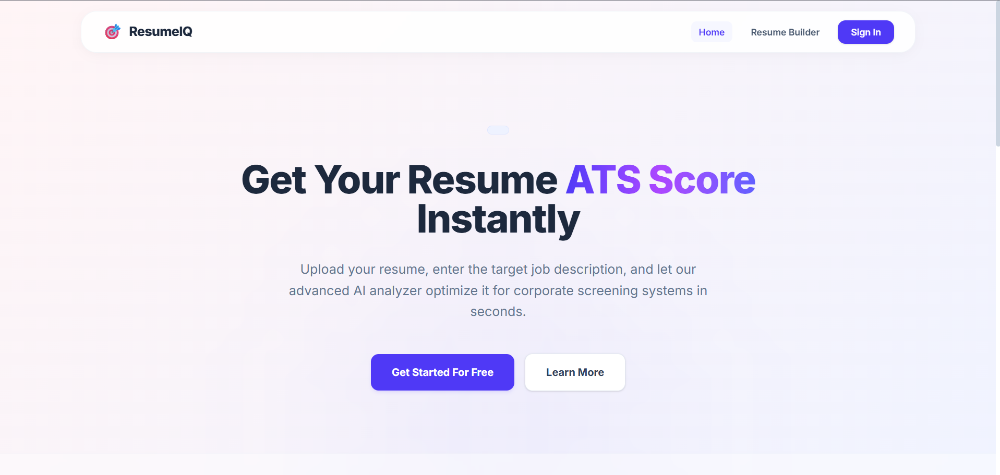
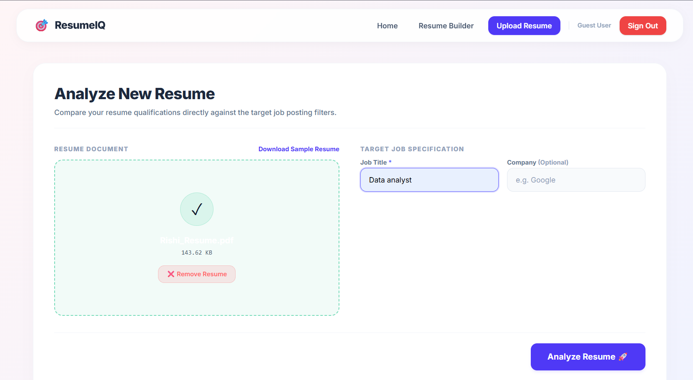
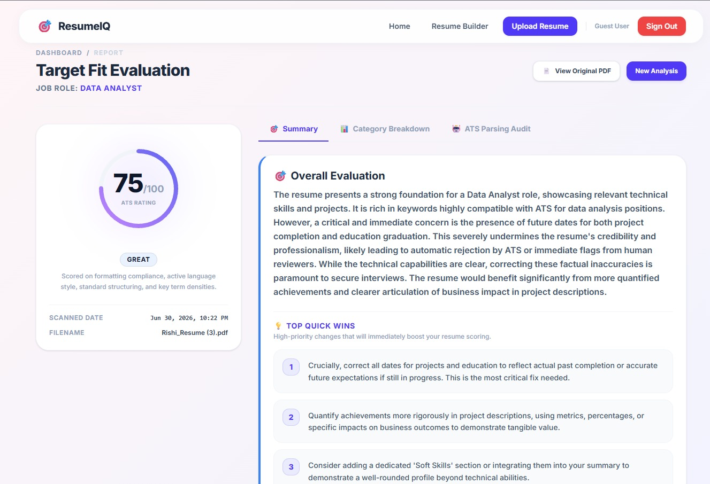
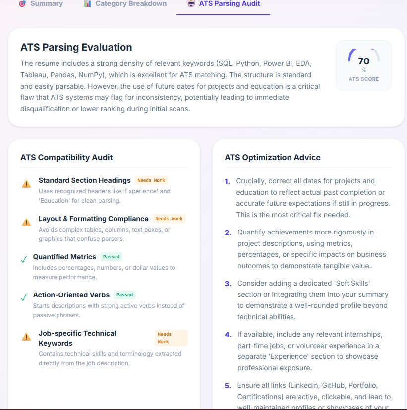

# 🚀 ResumeIQ - AI Powered ATS Resume Analyzer

<div align="center">


### 🤖 AI-powered Resume Analyzer for ATS Optimization

Upload your resume, analyze it using Google Gemini AI, receive an ATS score, detailed feedback, and personalized improvement suggestions.

### 🌐 Live Demo

**https://ai-resume-analyzer-frontend-rho.vercel.app/**

</div>

---

# 📖 Overview

ResumeIQ is a full-stack AI-powered ATS Resume Analyzer that evaluates resumes against a selected job role and company.

The application uses **Google Gemini AI** to generate intelligent resume feedback while calculating an ATS score based on multiple evaluation categories.

It helps candidates improve their resumes before applying for jobs.

---

# ✨ Features

- 📄 Upload PDF Resume
- 🤖 AI Resume Analysis
- 📊 ATS Compatibility Score
- 🎯 Role-based Resume Evaluation
- 🏢 Company-specific Analysis
- 📝 Detailed Improvement Suggestions
- 💡 Resume Optimization Tips
- ⚡ Fast Backend Processing
- 📱 Responsive UI
- 🔒 Secure API Integration

---

# 📸 Screenshots

>## 📸 Screenshots

### 🏠 Home Page



---

### 📤 Upload Resume



---

### 📊 AI Analysis Report



---

### 📈 ATS Compatibility Audit



# 🛠 Tech Stack

## Frontend

- React Router v7
- React 19
- TypeScript
- CSS

## Backend

- Node.js
- Express.js
- Google Gemini AI
- Multer
- PDF Parse

## Deployment

- Frontend → Vercel
- Backend → Render

---

# 📊 ATS Evaluation Categories

ResumeIQ evaluates resumes using:

- ATS Compatibility
- Resume Content Quality
- Skills Match
- Projects & Experience
- Resume Formatting

---

# 📂 Project Structure

```text
ResumeIQ
│
├── app
├── public
├── constants
├── types
├── backend
│
├── package.json
└── README.md
```

---

# ⚙ Installation

## Clone Repository

```bash
git clone https://github.com/Rishikesh0405/ai-resume-analyzer-frontend.git
```

Install Dependencies

```bash
npm install
```

Create Environment File

```env
VITE_API_URL=http://localhost:5000
```

Run Development Server

```bash
npm run dev
```

---

# 🌐 Backend

Backend Repository:

https://github.com/Rishikesh0405/ai--resume--analyzer

Backend Deployment:

https://ai-resume-analyzer-sig3.onrender.com

---

# 🚀 Future Enhancements

- Resume Builder
- AI Cover Letter Generator
- Interview Question Generator
- Resume Version Comparison
- Authentication Dashboard
- Resume Templates

---

# 👨‍💻 Developer

**Rishikesh Chandeliya**

GitHub:

https://github.com/Rishikesh0405

---

# ⭐ Support

If you found this project useful, consider giving it a ⭐ on GitHub.
